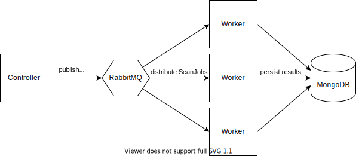

# TLS-Crawler

The TLS-Crawler is designed to perform large scale scans with the [TLS-Scanner](https://github.com/tls-attacker/TLS-Scanner).
To improve performance it supports distributing the workload to multiple machines.

## Architecture



The TLS-Crawler is split into two applications:
- the Controller which is responsible for creating scan jobs, distributing them among multiple workers and scheduling recurring scans
- the Worker which is responsible for performing the scans

Additionally, for distributing the work and persisting results two more components are required:
- a RabbitMq instance which handles the work distribution among workers
- a MongoDB database instance which stores the results of the scans.

## Getting Started

### Examples

Controller

        java -jar tls-crawler.jar controller -tranco 1000 -denylist resources/denylist.txt -portToBeScanned 443 -mongoDbHost mongo -mongoDbPort 27017 -mongoDbUser mongoadmin -mongoDbPass mongoadminpw -mongoDbAuthSource admin -rabbitMqHost rabbitmq -rabbitMqPort 5672 -scanName scanResults -monitorScan

Worker

        java -jar tls-crawler.jar worker -mongoDbHost mongo -mongoDbPort 27017 -mongoDbUser mongoadmin -mongoDbPass mongoadminpw -mongoDbAuthSource admin -rabbitMqHost rabbitmq -rabbitMqPort 5672  -numberOfThreads 30 -parallelProbeThreads 50

## Controller Commandline Reference

Scanner specific Configuration:
- `-portToBeScanned` the port that should be scanned
- `-timeout` the timeout to use inside the TLS-Scanner
- `-reexecutions` the number of reexecutions to use in the TLS-Scanner
- `-starttls` which start tls protocol should be used (required when scanning email servers)
- `-scanDetail` detail for the scanner (ALL, DETAILED, NORMAL, QUICK)

General Configuration:
- `-scanName string` the name of the scan
- `-hostFile path` a file with the list of servers which should be scanned, see #hostfile
- `-denylistFile path` a file with hosts/ip addresses or ip ranges that should not be scanned
- `-notifyUrl` url to which an HTTP POST request should be sent when a bulk scan is finished
- `-monitorScan` if set the controller monitors the progress of the scan and logs periodically how many servers have been scanned
- `-tranco int(=X)` if set the controller downloads the most recent [Tranco List](https://tranco-list.eu/) and scans the top X hosts

## Worker Commandline Reference

- `-numberOfThreads` number of worker threads the crawler worker should use
- `-parallelProbeThreads` number of worker threads the crawler worker should use
- `-scanTimeout` timeout after which the crawler tries to stop a scan if its still running (should be lower than rabbitMQ consumer ack because messages are only acknowledged at the end of a scan or the timeout)

### MongoDB Commandline Configuration

- `-mongoDbHost` host of the MongoDB instance the crawler should save the results in
- `-mongoDbPort` port of the MongoDB instance the crawler should save the results in
- `-mongoDbUser` username to be used to authenticate with MongoDB
- `-mongoDbPass` password to be used to authenticate with MongoDB
- `-mongoDbPassFile` path to file from where the password should be read (for use with docker secrets)
- `-mongoDbAuthSource` the DB within the MongoDB instance, in which the user:pass is defined

## RabbitMQ Commandline Configuration

- `-rabbitMqHost` hostname or ip of the RabbitMQ instance
- `-rabbitMqPort` port of the RabbitMQ instance
- `-rabbitMqUser` username to be used to authenticate with RabbitMQ
- `-rabbitMqPass` password to be used to authenticate with RabbitMQ
- `-rabbitMqPassFile` path to file from where the password should be read (for use with docker secrets)
- `-rabbitMqTLS` if the connection to the RabbitMQ instance should be TLS encrypted

## HostFile

The hosts to be scanned can be specified as domain or ip with or without port. Each line must only contain one host.
If no port is specified the port passed with the `-portToBeScanned` parameter is used (defaults to 443).

Example:

```
www.google.com:443
amazon.de
131.234.238.217:8080
131.234.238.217
```

# Using docker-compose

Instead of building the crawler yourself and starting it from the commandline, you can use `docker-compose.yml` and `build.sh`.
All parameters for the scan can be defined in the `docker-compose.yml`. `build.sh` can be used to build the crawler using
specifiable branches from the dependencies `TLS-Attacker` etc. Specify your Github username and access token so
Docker can download and build the dependencies. Finally, running `./build.sh` will build your custom crawler environment
in docker images. Using `docker-compose up` you can then start the scan. You can either use the Mongo-DB specified in the
`docker-compose.yml` or use an external database.
